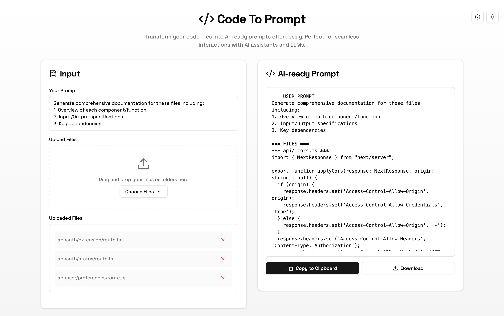

# Code To Prompt 🚀

> Transform your code files into AI-ready prompts effortlessly.

Code To Prompt is a modern web application that solves common frustrations when sharing code with AI platforms:

- 😫 Tired of hitting file upload limits on AI platforms?
- 🔄 Manually uploading the same files to different AI assistants?
- 📁 Can't upload entire project folders to get comprehensive help?

**Code To Prompt** solves these issues by combining multiple files into a single, well-formatted prompt that you can use anywhere. It intelligently processes your project folders while skipping unnecessary files like dependencies and build artifacts.



## ✨ Features

- 📁 **Directory Support**: Upload entire folders while intelligently ignoring common dependency and build directories
- 🎯 **Smart File Processing**: Automatically handles multiple file formats including code, text, and documentation files
- 🚫 **Smart Filtering**: Automatically filters out `node_modules`, build directories, binary files, and other non-text content
- 📋 **Easy Export**: Copy to clipboard or download your formatted prompts with a single click
- 🌐 **Completely FREE & open-source!**

## 🚀 Getting Started

### Prerequisites

- Node.js 18+ 
- npm or yarn

### Installation

1. Clone the repository:
```bash
git clone https://github.com/wahibonae/code-to-prompt.git
cd code-to-prompt
```

2. Install dependencies:
```bash
npm install
# or
yarn install
```

3. Start the development server:
```bash
npm run dev
# or
yarn dev
```

4. Open [http://localhost:3000](http://localhost:3000) in your browser

## 🎯 Usage

1. **Enter Your Prompt**: Start by typing your prompt or question in the input field
2. **Add Files**: Either:
   - Drag and drop files/folders into the upload area
   - Click "Choose Files" to select individual files
   - Click "Choose Folder" to select an entire directory
3. **Generate**: Click "Generate Prompt" to create your AI-ready prompt
4. **Export**: Either:
   - Copy the generated prompt to your clipboard
   - Download it as a text file

## 🛠️ Built With

- [Next.js](https://nextjs.org/) - React framework
- [Tailwind CSS](https://tailwindcss.com/) - Styling
- [Shadcn/ui](https://ui.shadcn.com/) - UI components
- [Motion](https://motion.dev/) - Animations
- [Lucide Icons](https://lucide.dev/) - Icons

## 🤝 Contributing

Contributions are what make the open source community such an amazing place to learn, inspire, and create. Any contributions you make are **greatly appreciated**.

1. Fork the Project
2. Create your Feature Branch (`git checkout -b feature/AmazingFeature`)
3. Commit your Changes (`git commit -m 'Add some AmazingFeature'`)
4. Push to the Branch (`git push origin feature/AmazingFeature`)
5. Open a Pull Request

Please make sure to update tests as appropriate and adhere to the existing coding style.

Thank you!!

## 📝 License

This project is licensed under the MIT License - see the [LICENSE](LICENSE) file for details.

## 👤 Author

**ABKARI Mohamed Wahib**

- GitHub: [@wahibonae](https://github.com/wahibonae)
- Twitter: [@wahibonae](https://twitter.com/wahibonae)
- Linkedin: [Mohamed Wahib ABKARI](https://www.linkedin.com/in/abkarimohamedwahib/)

## 🙏 Acknowledgments

- Thanks to everyone who inspired us to build `code-to-prompt`.
- Thanks to my friends & the community for the support!!
- Inspired by the need to streamline AI interactions with codebases.

## 📊 Roadmap

- [ ] Custom ignore patterns
- [ ] Prompt templates
- [ ] Multiple prompt formats for different AI models
- [ ] API endpoint for programmatic access

---

<p align="center">Made with ❤️ by wahib</p>
